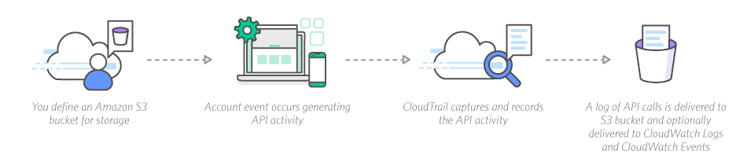
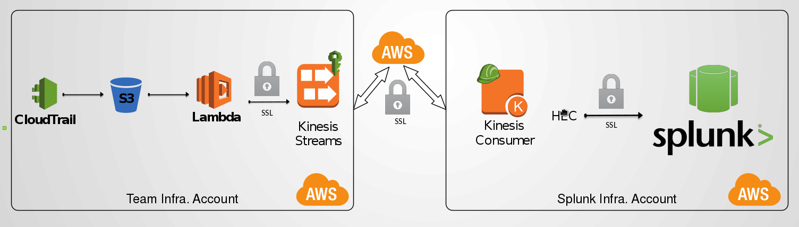

# CloudTrail

AWS CloudTrail is a service that enables governance, compliance, operational auditing, and risk auditing of your AWS account.

What this means in English is that it is a service that will record all API calls made to your account (via the GUI, CLI, SDKs and CloudFormation), store them 
and allow you to search them.

This history simplifies security analysis, resource change tracking, and troubleshooting.

The events are recorded in constructs called "Trails".

CloudTrail delivers the logs from a trail to an S3 bucket that you specify, and optionally to a CloudWatch Logs log group.

You can also specify an Amazon SNS topic that receives notifications of log file deliveries.



You should look at https://docs.aws.amazon.com/awscloudtrail/latest/userguide/cloudtrail-concepts.html or better yet, just play with it

### Some important notes

* You can interactively query events (via GUI or API) from the last 7 days only (for older ones you will need to manually process the logs from the Bucket)
* Visibility is not pefect (some read calls do not get logged, if you encounter this, raise a ticket with AWS)
* Be careful with time ranges in queries (you might get a lot more data than you expected)
  * You also might create **heavy load**
* Timestamps are in UTC (though the GUI will let you view events in your local time and handle conversion)
  * There are various ways to specify time https://docs.aws.amazon.com/awscloudtrail/latest/userguide/view-cloudtrail-events-cli.html#w2ab1b7c19c17c25c13
  * The easiest one for human parsing is likely `YYYY-MM-DD HH:MM AM|PM`

To see what stuff you can do via the CLI, run:

```
aws cloudtrail help
```

### How REA uses it

All REA accounts log trails into a central bucket

There is a process to ingest these into Skynet Splunk



Try and run a query for `index=cloudtraillogs *` in Skynet Splunk

### A few interesting queries

See who has logged into this account this month

```
aws cloudtrail lookup-events --lookup-attributes AttributeKey=EventName,AttributeValue=ConsoleLogin --start-time '2017-06-01 12:00 AM'
```

See what a given user has done in this account this month

```
aws cloudtrail lookup-events --lookup-attributes AttributeKey=Username,AttributeValue=USERNAME --start-time '2017-06-01 12:00 AM'
```

See all the Cloudformation stacks deployed in a given timeframe

```
aws cloudtrail lookup-events --lookup-attributes AttributeKey=EventName,AttributeValue=CreateStack --start-time '2017-06-01 1:00 pm' --end-time '2017-06-02 5:00 pm'
```

### Using CloudTrail to create restrictive policies

For our day to day work in AWS accounts, we use Federated roles that are very powerful, often far too powerful for the task we're performing...

Let's say we want to create an EC2 instance, we would need `ec2:RunInstances` and likely a few `ec2:Describe*` permissions.

We definitely don't need `ec2:*` yet in many cases, the Federated role grants just this!

* What if we made a mistake and deleted every instance in a prod account?
* What if an attacker was able to compromise our account and spin up a bunch of `p2.16xlarge` instances for cryptocurrency mining?

Using CloudTrail we can audit the calls made by our priviledged account and from that we can create a much more restrictive policy for doing the given job and nothing more.

This is especially useful for creating locked down policies for our build agents to use to deploy stuff.

Using IAM, we can even impose conditions such as "only allow stuff to be created in ap-southeast-2" or "only allow t2 instances to be started"

Another very helpful tool is https://awspolicygen.s3.amazonaws.com/policygen.html which will help you in crafting policies.

DEMO TIME!
